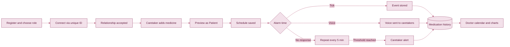
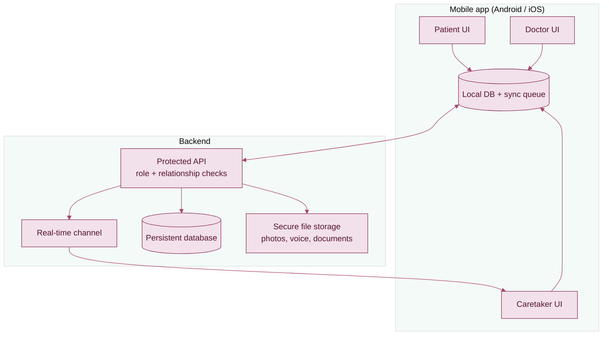

<a id="top"></a>

<p align="center">
  
</p>

<p align="center">
  <a href="#overview"></a>
  <a href="#roles"></a>
  <a href="#features"></a>
  <a href="#workflow"></a>
  <a href="#architecture"></a>
  <a href="#roadmap"></a>
  <a href="#setup"></a>
</p>

<p align="center">
  
  
  
  
</p>

<p align="center"></p>

## Overview

**MediGuard** is a connected medication-care app for families. An elderly patient may forget a dose, get confused about which medicine to take, or struggle with a complicated phone. MediGuard moves the complexity to the caretaker and gives the patient one simple action.

> **Caretaker manages** -> **Patient sees the exact medicine and taps once** -> **Caretakers are informed** -> **Doctor reviews the full history visually**

<p align="center">
  
</p>

<p align="right"><a href="#top">Back to top</a></p>

<p align="center"></p>

## Roles

Every account gets a unique ID (for example `MG-251047`, `CT-2045`, `DR-1024`) used to connect people.

| | Patient | Caretaker | Doctor |
|---|---|---|---|
| **Goal** | See the medicine, respond simply | Set up and monitor care | Understand adherence at a glance |
| **Interface** | Huge controls, high contrast, image-first | Detailed and organised | Graphical, clinical, chart-driven |
| **Key actions** | Tick, voice reply, SOS | Add medicine, schedules, stock, history | Calendar, charts, filters |
| **Extra setup** | SOS number + secondary language | Relationship type and permissions | Qualifications, licence, hospital |

Connections are **many-to-many** and **relationship-aware**: one patient can have several caretakers (Primary, Family), and one caretaker can manage several patients. Access is enforced per relationship, never by role alone.

<p align="right"><a href="#top">Back to top</a></p>

<p align="center"></p>

## Features

Click a section to expand it.

<details>
<summary><b>The Patient alarm</b> (the heart of the app)</summary>
<br>

The alarm is a full screen, not a text notification:

1. Caretaker avatar and name
2. Caretaker's message bubble (optional) and voice note play button
3. **Large medicine photograph** (the dominant visual)
4. Essential info in **English + the patient's chosen language**
5. Big **TICK** and big **MICROPHONE**, with no "Taken / Not taken" wording

Unanswered alarms repeat every 5 minutes. The number of unanswered alarms before caretakers are alerted is configurable.
</details>

<details>
<summary><b>Adding a medicine (Caretaker)</b></summary>
<br>

- Camera or upload, then crop, preview and confirm the medicine photo
- Visual steppers for tablet count and dosage
- Visual calendar for start and end dates
- Interactive circular alarm clock (draggable hand, AM/PM, Morning / Afternoon / Night presets)
- Frequency: one-time, multiple times, daily, selected weekdays, alternate days, weekly, custom
- Schedule preview timeline before saving
- Optional text note and optional voice note
- **Preview as Patient** to see exactly what the alarm will look like
</details>

<details>
<summary><b>Family synchronisation</b></summary>
<br>

- Real-time updates: tick confirmed, missed alarm, voice reply, schedule change
- Notifications always say **who did what, for which patient, and when**
- Activity/change history so nothing changes silently
</details>

<details>
<summary><b>Doctor analytics</b></summary>
<br>

- Medication calendar (complete / partial / missed days), tap a date to see that day
- Donut charts (taken vs missed), bar charts (per medicine), line charts (adherence over time)
- Adherence rings, scheduled-vs-actual timing, dose timelines
- Filters: Today, 7 Days, 30 Days, Custom, plus per-medicine
- Charts are driven only by real stored history, with no fake analytics
</details>

<details>
<summary><b>Offline-first reminders</b></summary>
<br>

```text
Online:   Server schedule  ->  Local device schedule
Offline:  Local schedule   ->  Alarm  ->  Response  ->  Local storage
Back on:  Sync queue  ->  Server  ->  Database  ->  Caretakers
```

Offline voice replies get a unique event ID, are marked *Waiting to sync*, are never silently deleted, and are de-duplicated on sync.
</details>

<details>
<summary><b>Inventory, SOS and more</b></summary>
<br>

- **Medicine inventory:** remaining supply bar, days left, refill warning about 2 days before running out
- **SOS:** one large button, one confirmation, calls the number registered at signup
- **Appointments:** search providers, pick doctor, date and time
- **Medical vault and OCR:** store reports and prescriptions; OCR results stay *unverified* until the user confirms
- **Medi_Loaded:** dedicated section for the future physical dispenser (pairing, device ID, status)
- **Light and Dark mode** across the whole app
</details>

<p align="right"><a href="#top">Back to top</a></p>

<p align="center"></p>

## Workflow



<p align="right"><a href="#top">Back to top</a></p>

<p align="center"></p>

## Architecture



**Security principles:** password hashing, secure token sessions, role-based **and** relationship-level access control, input validation, protected APIs, secure uploads. Entering a patient ID never grants access on its own; the patient must accept the connection.

<p align="right"><a href="#top">Back to top</a></p>

<p align="center"></p>

## Roadmap

- [ ] Registration and role-specific profiles
- [ ] ID-based connection requests and relationships
- [ ] Add-medicine flow (photo, clock, calendar, frequency, notes)
- [ ] Patient alarm with tick and voice response
- [ ] Unanswered-alarm escalation
- [ ] Offline-first scheduling and sync queue
- [ ] Real-time notifications and activity history
- [ ] Medicine inventory and refill warnings
- [ ] SOS
- [ ] Doctor calendar and analytics
- [ ] Appointments, medical vault and OCR
- [ ] Medi_Loaded device integration

<p align="right"><a href="#top">Back to top</a></p>

<p align="center"></p>

## Setup

> Replace this section with your real stack and commands.

```bash
git clone https://github.com/<your-username>/mediguard.git
cd mediguard
# install dependencies
# configure environment variables
# run the app
```

<p align="center"></p>

<p align="center">
  <sub>Built with care for the people who take care of others.</sub><br>
  <a href="#top">Back to top</a>
</p>
